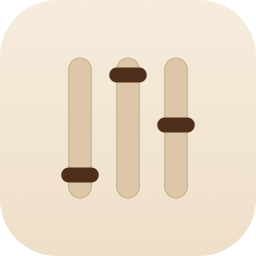

<p align="center">
  
</p>

<h1 align="center">SoundLevels</h1>

<p align="center">
  A per-application volume mixer for the macOS menu bar — the Windows-style "one slider per app"
  mixer macOS has never shipped natively.
</p>

Click the menu bar icon to see every application currently playing audio, each with its own
volume slider and mute toggle, without touching the system-wide volume or any other app.

## Why

macOS has no built-in way to turn down just one noisy app (a browser tab, a chat notification)
without affecting everything else. Windows has had this for over a decade. This is a small,
personal project to fix that — and to learn Swift/SwiftUI/Core Audio along the way.

## Requirements

- macOS 14.4 (Sonoma) or later, Intel or Apple Silicon
- Xcode 15.3+ (to build and run)

## Building & running

This is a Swift Package, not an `.xcodeproj` — open it directly in Xcode:

```bash
open Package.swift
```

Select the **SoundLevels** scheme (not `AudioMixerKit` or `SoundLevels-Package`) and Run (⌘R).

Or from the command line:

```bash
swift build
swift test   # runs the unit test suite
swift run    # launches the app
```

On first launch, macOS will ask for permission to record system audio — this is required by the
underlying Core Audio Process Tap API to discover and control per-app volume, and is what powers
the whole feature.

### Building a real, iconed `.app`

`swift run` launches a raw executable with no `.app` bundle, so no custom icon shows in Finder.
To produce a real, double-clickable, custom-iconed, ad-hoc signed `SoundLevels.app`:

```bash
./Scripts/build-app-bundle.sh
```

This builds a release binary, renders `Scripts/AppIcon.svg` into the `.icns` icon, assembles
`SoundLevels.app` at the repo root, and ad-hoc signs it. Safe to re-run any time — each run starts
from a clean slate.

## How it works

Built on the public [Core Audio Process Tap API](https://developer.apple.com/documentation/coreaudio)
(macOS 14.2+): each controlled application gets a private Aggregate Device combining a tap on its
audio with the real output device, and a running `AudioDeviceIOProc` that scales the captured
samples by the chosen volume (or silences them when muted) before writing them to the speakers.

### A known quirk: shared system helper processes

Some rows you'll see aren't a single "app" in the traditional sense. For example, **WebKit GPU**
is a shared process from the WebKit framework, used by *any* app with an embedded web view
(Safari, Mail, Notes, and others) — it isn't launched as a child process of one specific app, so
it can't be reliably folded into a single app's row. It's shown as its own entry rather than
guessed into the wrong app.

Multi-process apps that *do* spawn their own helpers as child processes or bundle them inside
their own `.app` (Chrome and most Chromium-based browsers, for example) are correctly grouped
under one row.

## Current limitations

- No keyboard shortcuts or launch-at-login yet.
- Tested on Intel; not yet verified on Apple Silicon hardware.

## Architecture

MVVM throughout, with Core Audio access isolated behind a protocol
(`AudioSessionProviding`) so the ViewModel/Model layer is fully unit-tested without needing real
audio hardware. See `Sources/AudioMixerKit/` for the business logic and `Tests/` for its test
suite.

## Feedback & bugs

This is a personal project built while learning Swift, SwiftUI, and Core Audio — it's very much a
work in progress, and I'm still learning as I go. If you download it and hit a bug, a crash, or
something that just feels wrong, please [open an issue](https://github.com/andgabx/SoundLevels/issues) —
real reports from real machines (especially Apple Silicon, which I haven't personally tested on)
are genuinely valuable and appreciated.

## License

MIT — see [LICENSE](LICENSE).
